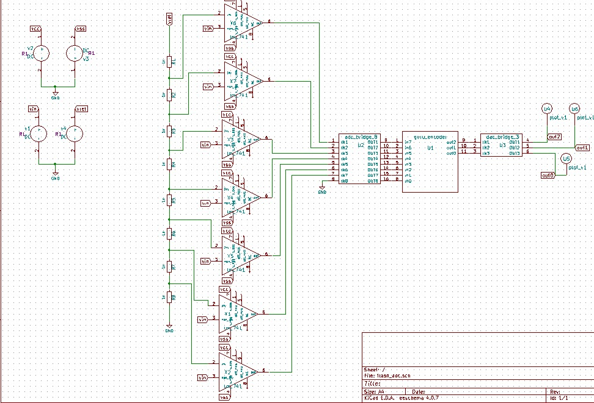
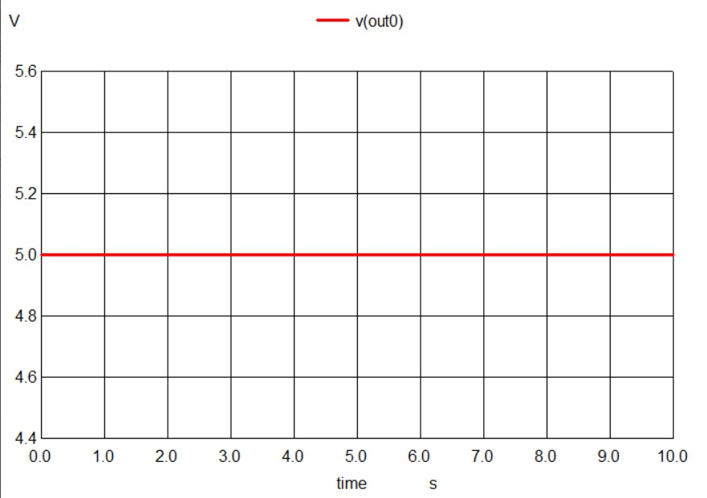
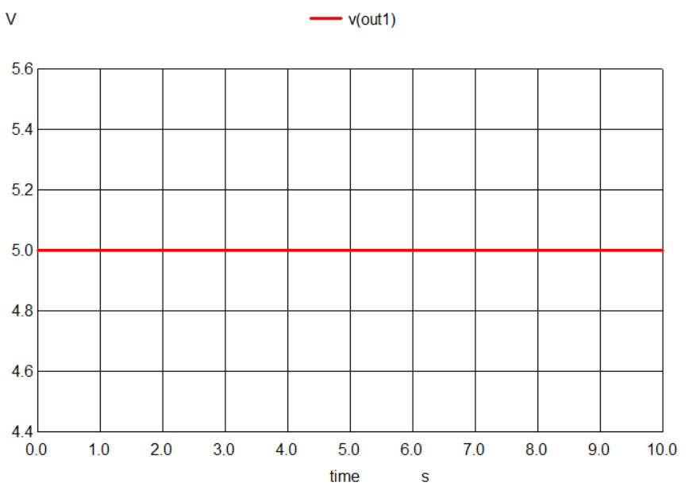
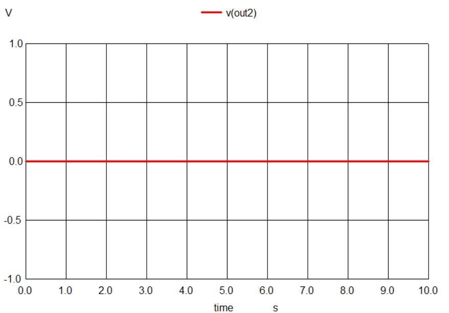

# Mixed Signal Circuit Design and Simulation Marathon
# Flash Type ADC
- [Abstract](#abstract)
- [Circuit Details](#circuit-details)
- [Software Used](#software-used)
  * [eSim](#esim)
  * [NgSpice](#ngspice)
  * [Makerchip](#makerchip)
  * [Verilator](#verilator)
- [Circuit Diagram in eSim](#circuit-diagram-in-esim)
- [Verilog Code](#verilog-code)
- [Makerchip](#makerchip-1)
- [Makerchip Plots](#makerchip-plots)
- [Netlists](#netlists)
- [NgSpice Plots](#ngspice-plots)
- [GAW Plots](#gaw-plots)
- [Steps to run generate NgVeri Model](#steps-to-run-generate-ngveri-model)
- [Steps to run this project](#steps-to-run-this-project)
- [Acknowlegdements](#acknowlegdements)
- [References](#references)

<small><i><a href='http://ecotrust-canada.github.io/markdown-toc/'>Table of contents generated with markdown-toc</a></i></small>


## Abstract
Flash type ADC is the fastest among all ADC’s. It requires only one clock cycle for conversion.This type of A/D converter is called parallel type ADC.
It consists of a series of comparators, each of them compares the input signal to a reference voltage Vref. 
The comparator outputs connect to the inputs of a priority encoder circuit, which then results in a binary output.

Keywords: Prioity encoder, comparator


## Circuit Details
 3-bit flash type ADC consists of a network of  voltage divider with 8 equal resistors.
 A reference voltage Vref is applied to the complete network which is with respect to the ground. 
 From bottom to top, the voltage drop across each resistor with respect to ground will be integer multiples of VR8. 
 The external input voltage Vi is applied to the  comparator’s non-inverting terminal.
 The same voltage drop found across each resistor from bottom to top is applied to the comparator’s inverting terminal from bottom to top. 
 Simultaneously, all the comparators compare the input external voltage to the voltage drops present at the corresponding input terminal, which means,
 the  operation of comparison takes place by parallelly. 
 The output at the comparator end will be ‘1’ till long as Vi is greater than the voltage drop present at the corresponding other input terminal. 
 Similarly, the output at the comparator end will be ‘0’, when, Vi becomes less than or equal to the voltage drop present at the corresponding input terminal. 
 Outputs of all the comparators are connected as the inputs of priority encoder. 
 This priority encoder yields digital outpur in the form of binary code,which relates to the high priority input which has 1.
 Hence, the output of priority encoder is the binary equivalent  of analog  external input voltage Vi.
 The components of Flash type ADC are high speed comparator (2n-1), Voltage divider resistive network (2n), Priority encoder (1).
## Software Used
### eSim
It is an Open Source EDA developed by FOSSEE, IIT Bombay. It is used for electronic circuit simulation. It is made by the combination of two software namely NgSpice and KiCAD.
</br>
For more details refer:
</br>
https://esim.fossee.in/home
### NgSpice
It is an Open Source Software for Spice Simulations. For more details refer:
</br>
http://ngspice.sourceforge.net/docs.html
### Makerchip
It is an Online Web Browser IDE for Verilog/System-verilog/TL-Verilog Simulation. Refer
</br> https://www.makerchip.com/
### Verilator
It is a tool which converts Verilog code to C++ objects. Refer:
https://www.veripool.org/verilator/

## Circuit Diagram in eSim
The following is the schematic in eSim:

## Verilog Code
```
module guru_encoder(input [7:0] in,
			output [2:0] out);

assign out = (in[7] ==1'b1 ) ? 3'b111:
               (in[6] ==1'b1 ) ? 3'b110:
               (in[5] ==1'b1 ) ? 3'b101:
               (in[4] ==1'b1) ? 3'b100:
               (in[3] ==1'b1) ? 3'b011:
               (in[2] ==1'b1) ? 3'b010:
               (in[1] ==1'b1) ? 3'b001:
               (in[0] ==1'b1) ? 3'b000: 3'bxxx;


endmodule
```

## Netlists
```
* r:\esim_simulations\gurubaran\flash_adc\flash_adc.cir

.include lm_741.sub
r1  vref net-_r1-pad2_ 1k
r2  net-_r1-pad2_ net-_r2-pad2_ 1k
r3  net-_r2-pad2_ net-_r3-pad2_ 1k
r4  net-_r3-pad2_ net-_r4-pad2_ 1k
r5  net-_r4-pad2_ net-_r5-pad2_ 1k
r6  net-_r5-pad2_ net-_r6-pad2_ 1k
r7  net-_r6-pad2_ net-_r7-pad2_ 1k
r8  net-_r7-pad2_ gnd 1k
x6 ? net-_r1-pad2_ vin vss ? net-_u2-pad1_ vcc ? lm_741
x7 ? net-_r2-pad2_ vin vss ? net-_u2-pad2_ vcc ? lm_741
x3 ? net-_r3-pad2_ vin vss ? net-_u2-pad3_ vcc ? lm_741
x4 ? net-_r4-pad2_ vin vss ? net-_u2-pad4_ vcc ? lm_741
x5 ? net-_r5-pad2_ vin vss ? net-_u2-pad5_ vcc ? lm_741
x1 ? net-_r6-pad2_ vin vss ? net-_u2-pad6_ vcc ? lm_741
x2 ? net-_r7-pad2_ vin vss ? net-_u2-pad7_ vcc ? lm_741
v2 vcc gnd  dc 14
v3 gnd vss  dc 14
v4 vref gnd  dc 5
* u1  net-_u1-pad1_ net-_u1-pad2_ net-_u1-pad3_ net-_u1-pad4_ net-_u1-pad5_ net-_u1-pad6_ net-_u1-pad7_ net-_u1-pad8_ net-_u1-pad9_ net-_u1-pad10_ net-_u1-pad11_ guru_encoder
* u2  net-_u2-pad1_ net-_u2-pad2_ net-_u2-pad3_ net-_u2-pad4_ net-_u2-pad5_ net-_u2-pad6_ net-_u2-pad7_ gnd net-_u1-pad1_ net-_u1-pad2_ net-_u1-pad3_ net-_u1-pad4_ net-_u1-pad5_ net-_u1-pad6_ net-_u1-pad7_ net-_u1-pad8_ adc_bridge_8
* u3  net-_u1-pad9_ net-_u1-pad10_ net-_u1-pad11_ out2 out1 out0 dac_bridge_3
* u4  out2 plot_v1
* u6  out1 plot_v1
* u5  out0 plot_v1
v1 vin gnd  dc 2
a1 [net-_u1-pad1_ net-_u1-pad2_ net-_u1-pad3_ net-_u1-pad4_ net-_u1-pad5_ net-_u1-pad6_ net-_u1-pad7_ net-_u1-pad8_ ] [net-_u1-pad9_ net-_u1-pad10_ net-_u1-pad11_ ] u1
a2 [net-_u2-pad1_ net-_u2-pad2_ net-_u2-pad3_ net-_u2-pad4_ net-_u2-pad5_ net-_u2-pad6_ net-_u2-pad7_ gnd ] [net-_u1-pad1_ net-_u1-pad2_ net-_u1-pad3_ net-_u1-pad4_ net-_u1-pad5_ net-_u1-pad6_ net-_u1-pad7_ net-_u1-pad8_ ] u2
a3 [net-_u1-pad9_ net-_u1-pad10_ net-_u1-pad11_ ] [out2 out1 out0 ] u3
* Schematic Name:                             guru_encoder, NgSpice Name: guru_encoder
.model u1 guru_encoder(rise_delay=1.0e-9 fall_delay=1.0e-9 input_load=1.0e-12 instance_id=1 ) 
* Schematic Name:                             adc_bridge_8, NgSpice Name: adc_bridge
.model u2 adc_bridge(in_low=1.0 in_high=2.0 rise_delay=1.0e-9 fall_delay=1.0e-9 ) 
* Schematic Name:                             dac_bridge_3, NgSpice Name: dac_bridge
.model u3 dac_bridge(out_low=0.0 out_high=5.0 out_undef=0.5 input_load=1.0e-12 t_rise=1.0e-9 t_fall=1.0e-9 ) 
.tran 1e-00 10e-00 0e-00

* Control Statements 
.control
run
print allv > plot_data_v.txt
print alli > plot_data_i.txt
plot v(out2)
plot v(out1)
plot v(out0)
.endc
.end
```
## NgSpice Plots




## Acknowlegdements
1. FOSSEE, IIT Bombay
2. Steve Hoover, Founder, Redwood EDA
3. Kunal Ghosh, Co-founder, VSD Corp. Pvt. Ltd. - kunalpghosh@gmail.com
4. Sumanto Kar, eSim Team, FOSSEE

## References
1. Megha R, Pradeepkumar K A, Implementation of Low Power Flash ADC By Reducing Comparators, https://ieeexplore.ieee.org/document/6949880
2. A. Payra, P. Dutta, A. Sarkar, S. K. Sen,DESIGN OF A SELF REGULATED FLASH TYPE ADC WITH HIGH RESOLUTION, https://ieeexplore.ieee.org/document/7513322

